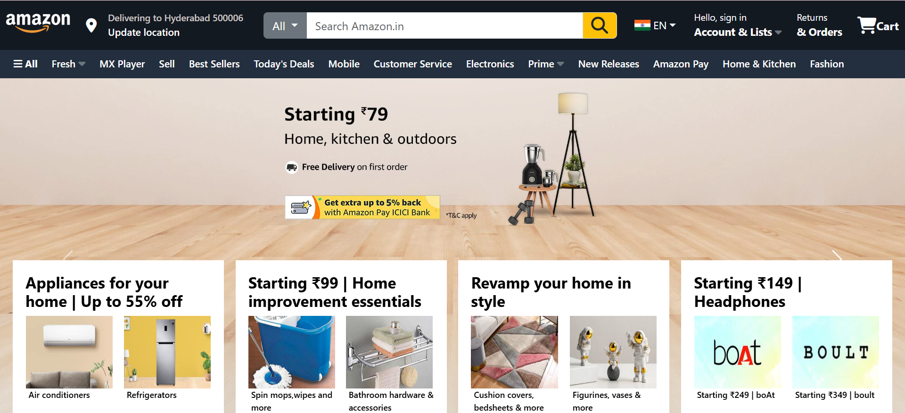

# 🛒 Amazon Clone

A fully responsive and visually engaging **Amazon homepage replica**, built with **HTML**, **CSS**, and **Bootstrap 5**. This project is a frontend exploration and design challenge aimed at replicating Amazon’s core homepage layout and user interface.

---

## 📸 Project Preview

  
*A glimpse of the homepage recreated with pixel-perfect precision.*

---

## 🌟 Features

- 🧭 **Sticky Navigation Bar**  
  Includes Amazon logo, search bar, language selector, account login, and cart icon.

- 📷 **Hero Section / Top Banner**  
  Displays dynamic promotions and key product highlights.

- 📦 **Product Sections**  
  Divided into categories like Electronics, Fashion, and Home Essentials.

- 🔄 **Reusable Product Cards**  
  Styled for consistency and hover effects for better user interactivity.

- 📱 **Fully Responsive**  
  Seamlessly adapts to different screen sizes using Bootstrap Grid and Flex utilities.

---

## 🛠️ Technologies Used

| Tool        | Purpose                        |
|-------------|--------------------------------|
| HTML5       | Structure of the webpage       |
| CSS3        | Styling and hover animations   |
| Bootstrap 5 | Layout and responsiveness      |

---

## 🚀 Live Demo

🌐 [Live Website Link](https://amazonclone-manvitha.netlify.app/)  
📂 [GitHub Repository](https://github.com/ManvithaPola/Amazon-clone)

---


## 🧠 What I Learned

- Structuring large-scale ecommerce UIs
- Leveraging **Bootstrap Grid & Flex** for dynamic layouts
- Creating component-based product cards
- Building a responsive navbar and search experience
- Improving page fluidity and mobile compatibility

---

## 🔧 How to Run Locally

1. Clone the repo:
   ```bash
   git clone https://github.com/ManvithaPola/Amazon-clone.git
2. Navigate to the project directory:
   cd amazon-clone
3. Open index.html in your browser.

---

## 📝 To-Do (Future Enhancements)
Add shopping cart and login functionality using JavaScript

Create a separate product detail page

Integrate backend using Firebase or Node.js

---

## 🙌 Acknowledgments
This is a non-commercial replica built for learning purposes only.
Inspired by Amazon India.
 
---

## 📄 License
This project is licensed under the MIT License.
